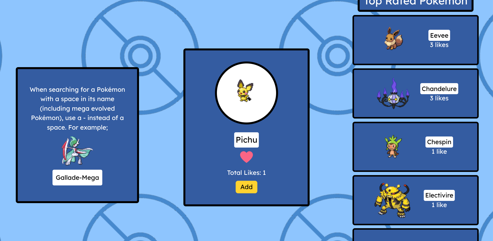

# PokeLister

Live Demo: https://poke-lister-seven.vercel.app/
Frontend Repo: https://github.com/hravv/PokeLister
Backend Repo: https://github.com/hravv/pokemon-backend  

---

## Table of Contents

- [Overview](#overview)
- [Features](#features)
- [Tech Stack](#tech-stack)
- [Architecture](#architecture)
- [Database Design](#database-design)
- [API Endpoints](#api-endpoints)
- [Usage](#usage)
- [Screenshots](#screenshots)
- [Deployment](#deployment)
- [Future Improvements](#future-improvements)
- [Credits](#credits)
- [License](#license)

---

## Overview

### Motivation
This project originally started as a task in my coding course that required me to perform a fetch operation with the PokeAPI RESTful API. I then decided to build a CRUD system around this, and was then given the idea to create a like system and leaderboard, with which I took my first step into backend development.

### Objective
While this app can be utilised to add Pokemon to a list, rate them, and check other people's ratings, it mainly serves as a demonstration of my understanding of UI/UX design principles and creating responsive, clean interfaces.

### Learning Outcomes
- Created backend server
- Utilised RESTful API
- Connected frontend to backend
- Deployed full-stack application

---

## Features

- CRUD functionality
- Fully responsive design
- Search functionality

---

## Tech Stack

### Frontend
- React
- HTML5
- CSS3 / Tailwind
- Fetch API

### Backend
- Node.js + Express 
- REST API
- Render
  
### Database
- PostgreSQL
- Neon

### Tools
- Git & GitHub
- VS Code
- Neon
- Render

---

## Architecture

## Search
Client (Frontend)  
↓  
Server (REST API)  

## Like
Client (Frontend)
↓
Server (Backend)
↓ 
Database (Neon)

---

## Database Design

### Items
- id
- name
- likes

---

## API Endpoints

| Method | Endpoint           | Description        |
|--------|-------------------|--------------------|
| POST   | /api/like | Adds 1 like to specific Pokemon |
| POST   | /api/unlike | Removes 1 like from specific Pokemon |
| GET    | /backend/likes/chosenPokemon | Accesses like total for specific Pokemon |
| GET   | https://pokeapi.co/api/v2/pokemon/${input} | Retrieves API data for selected Pokemon | 

---

## Usage

1. Enter Pokemon name in input field (try 'Pikachu' if unsure)  
2. Rate Pokemon by clicking heart button (optional)
3. Scroll to view team
4. Remove item if necessary

---

## Screenshots

---

## Deployment

- Backend deployed on Render
- Frontend deployed on Vercel
- Database hosted on Neon

---

## Future Improvements

- Add 'scroll down' arrow appearing on add
- Improve animations
- Add option to save list as image

---

## Credits

Developer: Harvey Burman
GitHub: https://github.com/hravv  

---

## License

This project is licensed under the MIT License.
